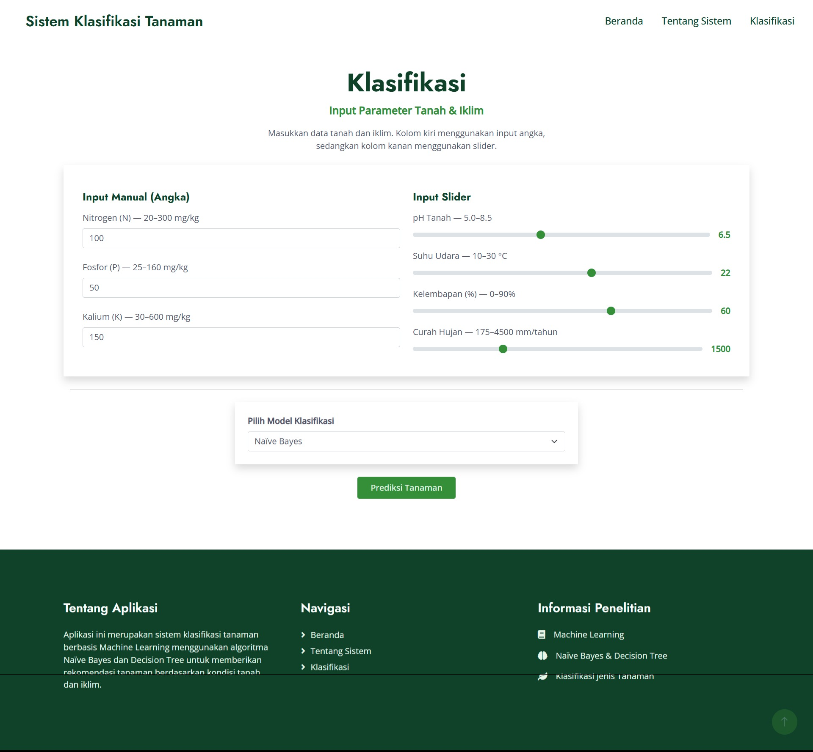
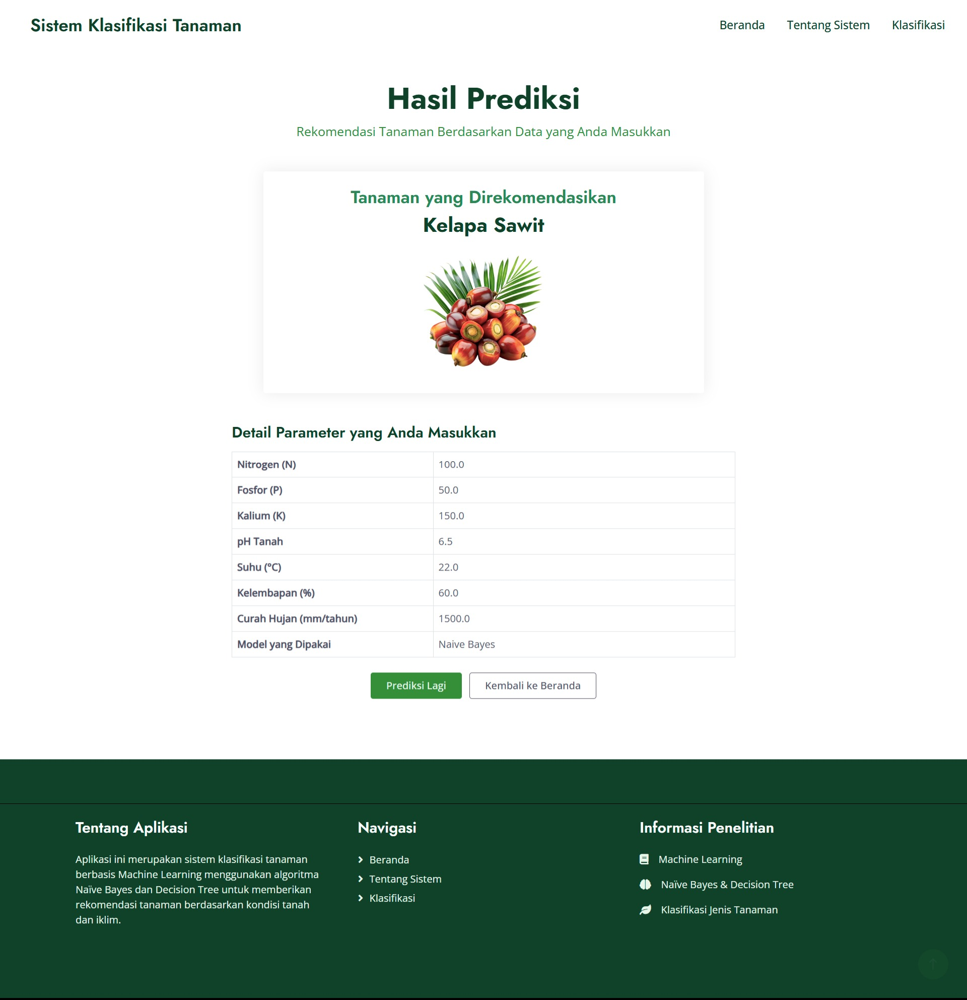

# 🌿 Sistem Klasifikasi Tanaman Menggunakan Machine Learning

Aplikasi ini dikembangkan untuk membantu proses **identifikasi dan klasifikasi tanaman** berdasarkan ciri-ciri tertentu.  
Sistem ini memanfaatkan **Machine Learning** sehingga mampu memberikan hasil prediksi secara cepat, akurat, dan mudah dipahami.

Aplikasi ini dapat digunakan untuk:
- Mengidentifikasi jenis tanaman berdasarkan input ciri  
- Menampilkan hasil prediksi beserta gambar dan deskripsi  
- Membantu pembelajaran botani dan pengenalan tanaman  
- Menjadi dokumentasi visual untuk penelitian atau tugas akhir  

---

## 📸 Cuplikan Tampilan Aplikasi

Berikut adalah dokumentasi tampilan antarmuka aplikasi:

| No | Halaman | Cuplikan |
|----|---------|----------|
| 1 | Halaman Home |  |
| 2 | Halaman Klasifikasi |  |
| 3 | Halaman Hasil |  |

---

## 🔒 Akses Source Code

Kode sumber **tidak dipublikasikan secara umum**.  
Untuk mendapatkan akses penuh terhadap source code aplikasi ini, silakan hubungi:

📞 **+62 85849604654 (Roni)**  
📧 **ronn.7ex@gmail.com**

---

## 🛠️ Teknologi yang Digunakan
- **Python**
- **HTML / CSS**
- **Bootstrap 5**
- **JavaScript**
- **Machine Learning Model (Opsional)**
- **Dataset Tanaman**
- **Responsive Web Design**

---

## 🌱 Tentang Sistem Klasifikasi Tanaman

Aplikasi ini bekerja dengan langkah sebagai berikut:

1. Pengguna memasukkan data ciri-ciri tanaman  
2. Data diproses oleh model machine learning  
3. Sistem mengidentifikasi jenis tanaman paling mendekati  
4. Hasil ditampilkan dalam bentuk gambar, deskripsi, dan tingkat akurasi  

Metode ini efektif untuk:
- Identifikasi cepat tanaman  
- Pembelajaran botani  
- Sistem pendukung keputusan  
- Proyek penelitian atau tugas akhir  

---

## 👨‍💻 Pengembang

Dikembangkan oleh: **Roni, S.Kom**  
Tahun: **2025**  
Aplikasi ini dibuat sebagai dokumentasi sistem klasifikasi berbasis machine learning.

---

© 2025 – Sistem Klasifikasi Tanaman  
Seluruh hak cipta dilindungi.
